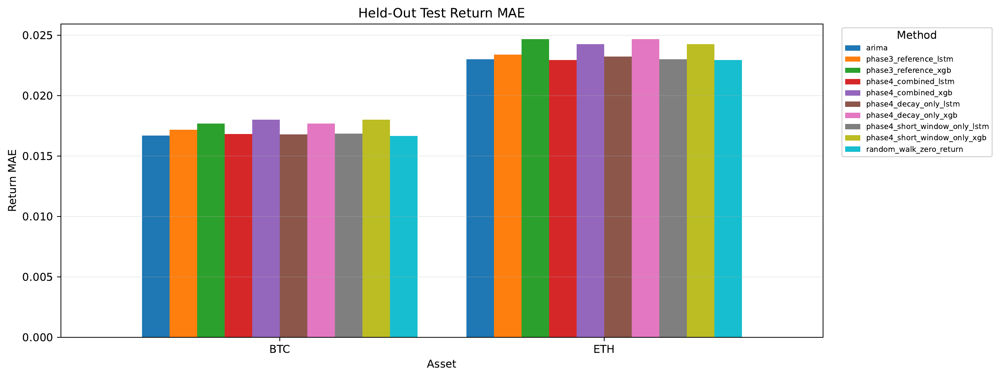
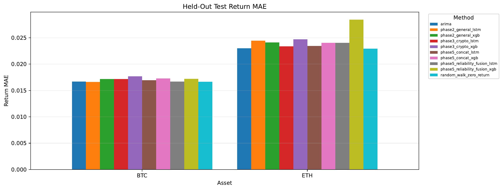
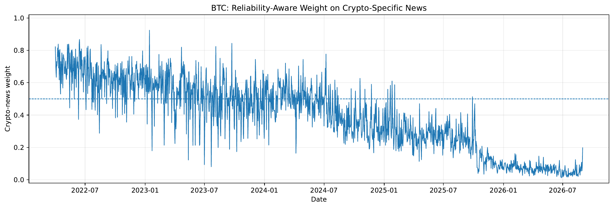
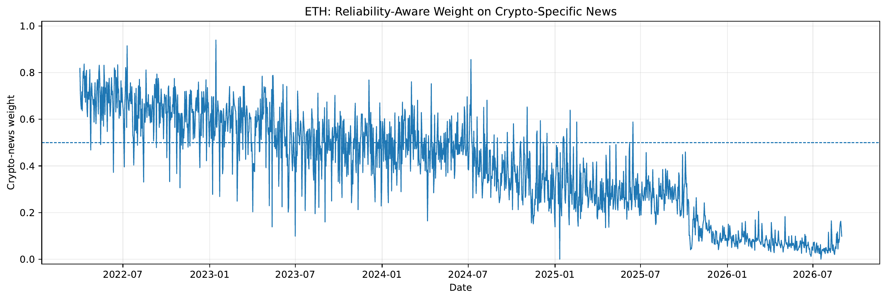
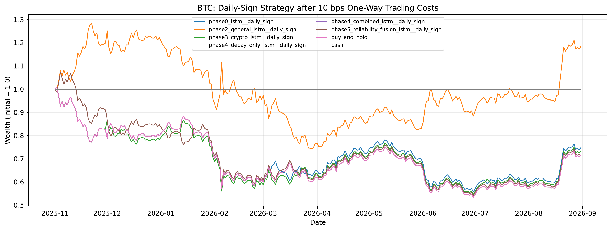
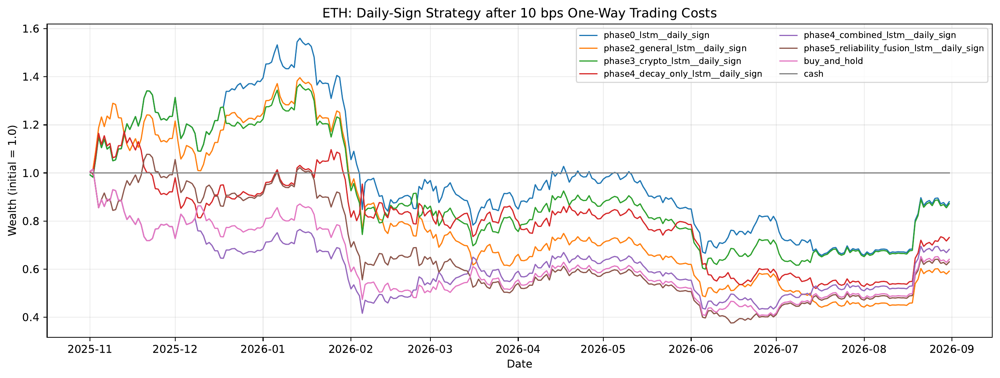
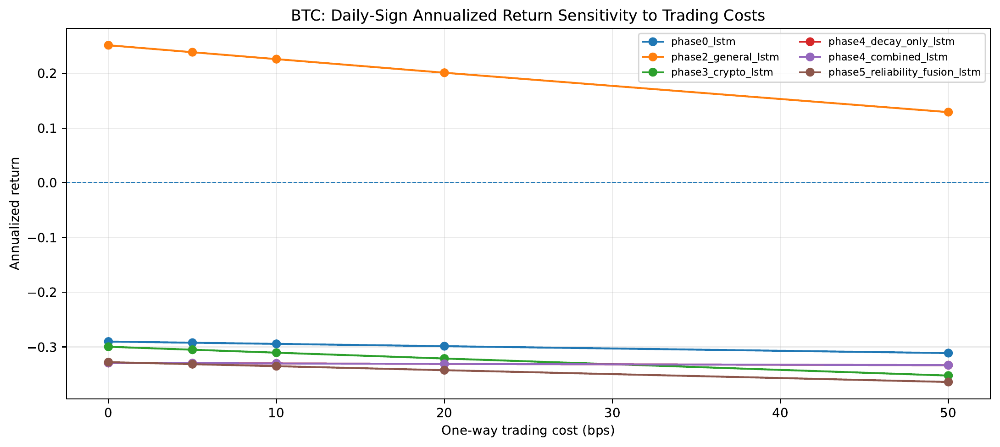
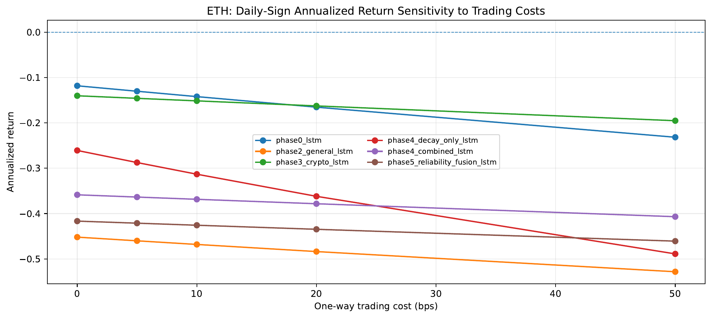

# Cryptocurrency Return Forecasting with Financial News Sentiment

  <b>BTC & ETH · FinBERT · LSTM · XGBoost · Walk-Forward Validation · Economic Backtesting</b>

  A research project on <b>when and how financial-news sentiment adds predictive value</b> to next-day cryptocurrency return forecasting.

---

## Overview

This project studies whether financial-news sentiment improves next-day return forecasts for **Bitcoin (BTC)** and **Ethereum (ETH)** beyond structured market variables alone.

Rather than treating sentiment as one fixed feature, the study progressively tests:

- **sentiment representation**: API sentiment vs. FinBERT
- **news scope**: general financial vs. crypto-specific news
- **temporal treatment**: standard windows, shorter windows, and recency decay
- **adaptive information fusion**: reliability-aware general/crypto sentiment combination
- **economic value**: trading performance after transaction costs

> **Main finding:** News sentiment provides **modest but heterogeneous** predictive value. Its usefulness depends on the asset, sentiment representation, news scope, model architecture, and temporal treatment. Improvements are clearer in forecast-error metrics than in directional accuracy.

---

## Research Design

| Stage | Question | Main Comparison |
|---|---|---|
| **Phase 0** | Can market variables alone forecast next-day returns? | LSTM/XGBoost vs. Random Walk and ARIMA |
| **Phase 1** | Does general financial-news sentiment help? | Market-only vs. market + API sentiment |
| **Phase 2** | Does sentiment representation matter? | API sentiment vs. FinBERT |
| **Phase 3** | Does news scope matter? | General-financial vs. crypto-specific FinBERT |
| **Phase 4** | Does temporal recency matter? | Reference vs. short window vs. decay vs. combined |
| **Phase 5** | Can news scopes be combined dynamically? | Single-scope vs. concat vs. reliability-aware fusion |
| **Economic Evaluation** | Do forecast gains translate into economic value? | Trading strategies under 0–50 bps costs |

---

## Data

### Assets and external market variables

- **Bitcoin:** `BTC-USD`
- **Ethereum:** `ETH-USD`
- **S&P 500:** `^GSPC`
- **CBOE VIX:** `^VIX`

Market data are retrieved through **Yahoo Finance (`yfinance`)**. Financial and cryptocurrency news are obtained from **Alpha Vantage**.

### Why Solana is excluded

Solana was evaluated in a pre-modeling coverage audit but excluded from the main study because its historical news corpus had substantially weaker publisher diversity than BTC and ETH. This decision was made **before model evaluation** and was based on coverage and source-diversity diagnostics, not forecasting performance.

---

## Forecasting Target

The study predicts the **next-day log return** rather than the raw price level:

$$
r_{t+1}=\ln\left(\frac{P_{t+1}}{P_t}\right)
$$

Using returns reduces the risk of mistaking price persistence for predictive skill and enables a more meaningful comparison with financial baselines.

---

## Market Features

The common feature set after training-period-only VIF screening includes:

`Log_Return`, `Return_lag1`, `Return_lag3`, `Return_lag5`, `RSI`, `volatility_20d`, `volume_change`, `volume_vs_MA5`, `intraday_range`, `SP500_Return`, and `VIX_Change`.

All scaling is fitted on the **training period only**.

---

## News and Sentiment Pipeline

1. Remove duplicate articles using article IDs and normalized title-source-date matching.
2. Exclude conservatively identified automated market-recap articles while retaining normal editorial reporting.
3. Apply or reuse article-level **FinBERT** outputs.
4. Aggregate article sentiment into daily features.
5. Align day-`t` information with the day-`t+1` return target.

The main article sentiment score is:

$$
S_{article}=P(positive)-P(negative)
$$

---

## Experimental Setup

| Split | Period |
|---|---|
| **Warm-up** | 2022-04-01 onward |
| **Train** | 2022-05-01 to 2025-03-31 |
| **Validation** | 2025-04-01 to 2025-10-31 |
| **Test** | 2025-11-01 to 2026-08-31 |

The final test set contains **304 held-out observations per asset**.

Robustness checks include:

- 5 random seeds
- chronological training with no shuffle
- walk-forward evaluation
- paired Wilcoxon tests on daily absolute errors
- exact binomial tests for directional accuracy

---

# Key Results

## Phase 0 — Market-Only Baseline

Market variables alone provide limited next-day return predictability. Random Walk and ARIMA remain difficult to beat consistently.

| Asset | Method | Test MAE | Test $R^2$ | Directional Accuracy |
|---|---|---:|---:|---:|
| BTC | Random Walk | **0.016665** | -0.0021 | — |
| BTC | ARIMA | 0.016677 | -0.0019 | 48.36% |
| BTC | LSTM | 0.016844 | -0.0174 | 47.70% |
| BTC | XGBoost | 0.017511 | -0.0781 | 49.67% |
| ETH | Random Walk | **0.022939** | -0.0019 | — |
| ETH | ARIMA | 0.022992 | -0.0057 | 51.97% |
| ETH | LSTM | 0.023401 | -0.0261 | 50.33% |
| ETH | XGBoost | 0.024515 | -0.0658 | 50.00% |

**Takeaway:** market history alone is a demanding baseline for next-day crypto return forecasting.

---

## Phase 1 — General Financial-News Sentiment

Adding general financial-news sentiment produces only modest and unstable gains. Removing automated MarketWatch recap articles reduces BTC directional performance more than it changes MAE.

**Takeaway:** text that mechanically restates market movements can create misleading sentiment signals without adding independent information.

---

## Phase 2 — General Financial News with FinBERT

FinBERT produces the clearest BTC improvement in the study.

| Asset | Model | Phase 0 MAE | Phase 2 MAE | Result |
|---|---|---:|---:|---|
| BTC | LSTM | 0.016844 | **0.016615** | Best held-out BTC MAE |
| BTC | XGBoost | 0.017511 | **0.017173** | Improvement over market-only XGB |
| ETH | LSTM | 0.023401 | 0.024451 | Worse than market-only |
| ETH | XGBoost | 0.024515 | **0.024103** | Small improvement |

**Takeaway:** better sentiment representation matters, but FinBERT is not universally beneficial across assets and models.

---

## Phase 3 — General vs. Crypto-Specific News

News specificity is **not universally better**.

- **BTC:** general financial FinBERT performs better than crypto-specific FinBERT.
- **ETH LSTM:** crypto-specific FinBERT performs better than general financial FinBERT.

For ETH LSTM, crypto-specific sentiment improves held-out MAE by about **4.4%** relative to general-news FinBERT and substantially improves seed stability.

> **Conclusion:** The optimal information scope is **asset- and architecture-dependent**.

---

## Phase 4 — Temporal Ablation

The temporal experiment isolates short-window and exponential-decay effects while keeping the model specification fixed.

| Variant | LSTM Lookback | XGB Lookback | Decay |
|---|---:|---:|---:|
| Reference | 30 | 30 | No |
| Short window only | 7 | 14 | No |
| Decay only | 30 | 30 | 0.95 |
| Short + decay | 7 | 14 | 0.95 |

### Held-out LSTM results

| Asset | Reference | Short Only | Decay Only | Combined | Best |
|---|---:|---:|---:|---:|---|
| BTC | 0.017160 | 0.016848 | **0.016776** | 0.016819 | **Decay only** |
| ETH | 0.023374 | 0.022989 | 0.023229 | **0.022930** | **Short + decay** |

  

**Takeaway:** recent observations can matter more than older observations, but the best temporal treatment differs by asset.

---

## Phase 5 — Reliability-Aware Dual-Scope Fusion

Phase 5 tests whether general-financial and crypto-specific sentiment should be **combined dynamically** instead of using a fixed source or naive concatenation.

### BTC held-out comparison

| Method | MAE |
|---|---:|
| **Phase 2 General FinBERT LSTM** | **0.016615** |
| Random Walk | 0.016665 |
| ARIMA | 0.016677 |
| **Phase 5 Reliability Fusion LSTM** | **0.016677** |
| Phase 4 Decay LSTM | 0.016776 |
| Phase 5 Naive Concat LSTM | 0.016941 |
| Phase 3 Crypto LSTM | 0.017160 |

### ETH held-out comparison

| Method | MAE |
|---|---:|
| **Phase 4 Combined LSTM** | **0.022930** |
| Phase 3 Crypto LSTM | 0.023374 |
| Phase 5 Naive Concat LSTM | 0.023463 |
| Phase 5 Reliability Fusion LSTM | 0.024054 |
| Phase 2 General LSTM | 0.024451 |

  

### Dynamic news-scope weights

  
  

**Takeaway:** reliability-aware fusion can outperform naive multi-source concatenation in some settings, but it does not consistently beat the best single-scope model.

---

# Economic Backtest

Forecast accuracy does not automatically imply economic value. Model predictions are therefore converted into simple long/short signals and evaluated under **0, 5, 10, 20, and 50 bps** transaction costs.

Positive forecasts generate long positions; negative forecasts generate short positions.

### Selected results at 10 bps

| Asset | Strategy | Total Return | Annualized Return | Sharpe | Max Drawdown |
|---|---|---:|---:|---:|---:|
| BTC | **Phase 2 General FinBERT LSTM** | **18.51%** | 22.61% | 0.67 | -42.19% |
| ETH | **Phase 5 Concat XGBoost** | **33.59%** | 41.58% | 0.86 | -52.25% |
| ETH | Phase 2 General XGBoost | 27.72% | 34.15% | 0.78 | -50.53% |

### Cumulative wealth

  
  

### Transaction-cost sensitivity

  
  

**Economic takeaway:** some strategies retain positive net returns after moderate transaction costs, but drawdowns remain large and the economic gains are not consistently statistically robust.

---

# Overall Findings

1. **Market-only forecasting is difficult.** Random Walk and ARIMA remain strong baselines.
2. **Sentiment representation matters.** FinBERT helps in some settings, especially for BTC.
3. **News scope is asset-dependent.** BTC generally benefits more from broad financial news, while ETH LSTM benefits more from crypto-specific news.
4. **Temporal treatment matters.** BTC LSTM benefits most consistently from recency decay; ETH responds more strongly to short-window + decay in the fixed test period.
5. **Adaptive fusion is useful but not universal.** Reliability-aware fusion improves over naive concatenation for BTC LSTM but does not consistently beat the strongest single-scope model.

> **Broader conclusion:** Sentiment should be treated as a **complementary and context-dependent source of predictive information**, not a universal solution for cryptocurrency forecasting.

---

## Reproducibility Notes

- Raw Alpha Vantage news data are **not included** because of provider licensing and file-size constraints.
- Market data can be recreated using `yfinance`.
- The repository includes preprocessing, modeling, evaluation, and backtesting code.
- Final test data are kept separate from training and validation decisions.

See [`data/README.md`](data/README.md) for data details.

---

## Disclaimer

This repository is for **research and educational purposes only**. Forecasting and backtesting results do not constitute investment advice, and historical or simulated performance does not guarantee future returns.

---

## Topics

`cryptocurrency` · `bitcoin` · `ethereum` · `time-series-forecasting` · `sentiment-analysis` · `finbert` · `financial-news` · `financial-machine-learning` · `lstm` · `xgboost` · `quantitative-finance` · `nlp`
