# Final Output Report

This folder contains the final experimental outputs for **“When Does News Sentiment Help Cryptocurrency Return Forecasting? A Multi-Phase Study of FinBERT Scope and Recency.”**

> **Important:** the forecasting target is **next-day log return**, not the raw cryptocurrency price level. The prediction figures below therefore show actual versus predicted daily returns for BTC and ETH over the held-out test period.

## 1. Experimental Scope

The study evaluates BTC and ETH daily return forecasting from May 2022 through August 2026. The locked held-out period is November 1, 2025 through August 31, 2026, with 304 test observations per asset. Models are evaluated using MAE, RMSE, R², directional accuracy, financial benchmarks, statistical tests, and expanding-window walk-forward validation.

The six experimental phases are:

| Phase | Added information | Main purpose |
|---|---|---|
| Phase 0 | Market variables only | Establish financial and machine-learning baselines |
| Phase 1 | Simple general-news sentiment | Test whether basic sentiment adds value |
| Phase 2 | General-news FinBERT features | Test whether a stronger sentiment representation helps |
| Phase 3 | Crypto-specific FinBERT features | Test whether information scope differs by asset |
| Phase 4 | Short window and/or decay weighting | Test temporal recency effects |
| Phase 5 | Reliability-aware dual-scope fusion | Explore adaptive combination of general and crypto news |

Financial benchmarks are a zero-return random walk and validation-selected ARIMA specifications. LSTM and XGBoost are evaluated under fixed specifications. Stochastic-model comparisons use five prespecified seeds.

---

## 2. Executive Summary of Final Findings

| Finding | Held-out evidence | Walk-forward evidence | Interpretation |
|---|---:|---:|---|
| BTC Phase 2 general-news FinBERT vs Phase 0 LSTM | +0.67% MAE improvement | +0.61% | Small but directionally stable; not Holm-significant |
| BTC general-news vs crypto-specific FinBERT | **+2.49%** | +1.45% | General financial news is more useful for BTC |
| ETH crypto-specific vs general-news FinBERT | **+3.84%** | +0.85% | Crypto-specific news is more useful for ETH |
| BTC Phase 4 short window vs Phase 3 reference | +1.13% | +0.23% | Small temporal effect; not robust after correction |
| ETH Phase 4 combined vs Phase 3 reference | +2.36% | +0.72% | Best Phase 4 ETH treatment; not robust after correction |
| ETH reliability fusion vs general-news FinBERT | **+5.32%** | +1.30% | Strong held-out gain, but incremental robustness is limited |

The central result is **not** that sentiment always improves cryptocurrency forecasts. Instead, its value depends on the asset, information scope, forecasting architecture, and evaluation regime.

---

# 3. Phase 0: Market-Only Baselines

Phase 0 establishes how difficult next-day return prediction is before any sentiment information is added.

### Held-out MAE

| Asset | Random walk | ARIMA | LSTM | XGBoost |
|---|---:|---:|---:|---:|
| BTC | **0.016665** | 0.016677 | 0.016727 | 0.017511 |
| ETH | **0.022939** | 0.022992 | 0.023778 | 0.024515 |

The learned models do not consistently beat the naive financial benchmarks. This is important because later sentiment gains are evaluated against credible baselines rather than against an artificially weak benchmark.

### Summary metrics

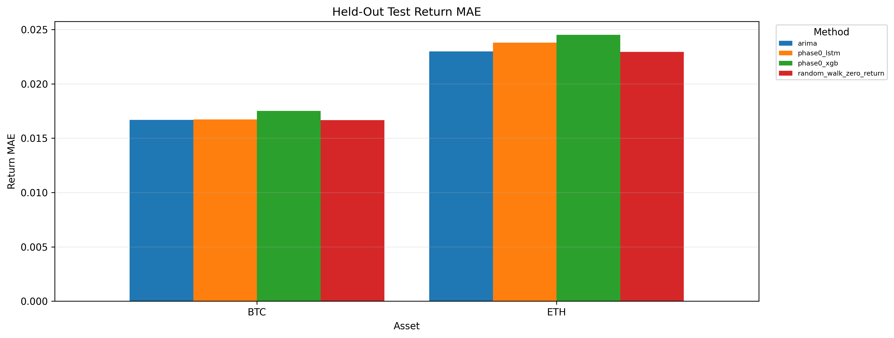

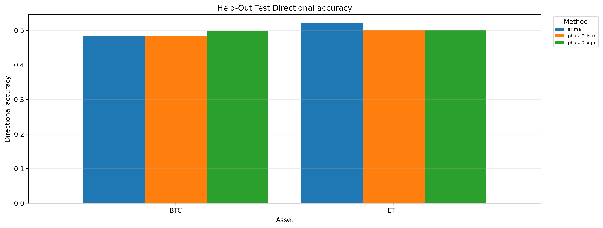

### Held-out return forecasts

**BTC**

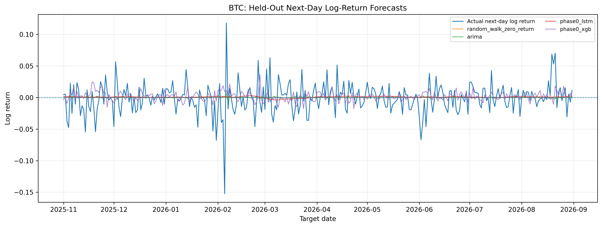

**ETH**

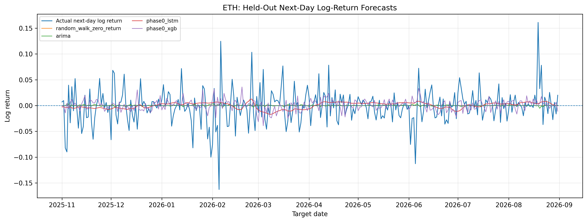

Main files: `phase0/ensemble_metrics.csv`, `phase0/ensemble_predictions.csv`, `phase0/significance_final.csv`, and the corresponding walk-forward files.

---

# 4. Phase 1: Simple General-News Sentiment

Phase 1 adds daily article count, average sentiment, and confidence-weighted sentiment from the provider's general-news scores.

### Key held-out results

| Asset / Model | Phase 0 MAE | Phase 1 MAE | Direction |
|---|---:|---:|---|
| BTC LSTM | 0.016727 | 0.016956 | Worse |
| BTC XGBoost | 0.017511 | 0.017707 | Worse |
| ETH LSTM | 0.023778 | **0.023061** | Better |
| ETH XGBoost | 0.024515 | 0.025617 | Worse |

ETH LSTM improves by about 3.0% in the held-out sample, but its walk-forward MAE is 0.023430 versus 0.023306 for the Phase 0 LSTM, so the fixed-sample improvement does not persist. The held-out ETH LSTM comparison has raw DM-HAC evidence, but it does not remain significant after Holm correction.

### Summary metrics

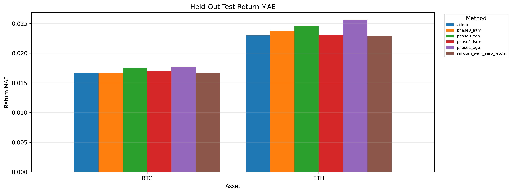

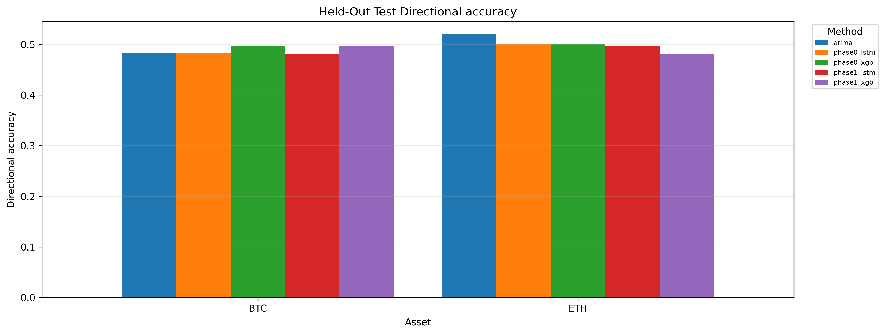

### Held-out return forecasts

**BTC**

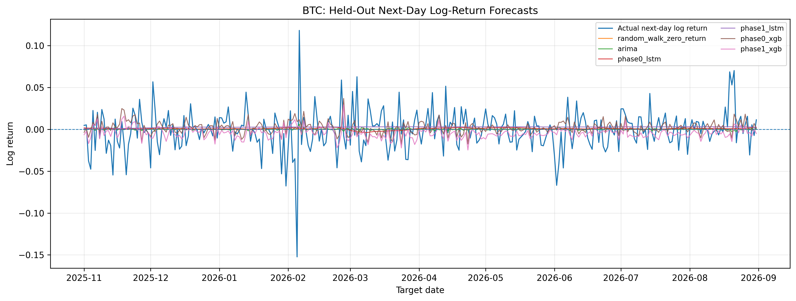

**ETH**

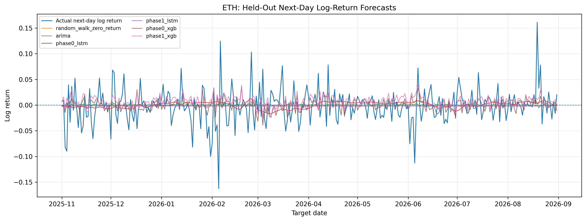

A separate preprocessing audit documents duplicate removal, UTC alignment, and removal of automated MarketWatch recap articles.

---

# 5. Phase 2: General-News FinBERT

Phase 2 replaces the simple provider sentiment representation with three FinBERT-derived daily features: confidence-weighted sentiment, within-day sentiment dispersion, and 3-day sentiment momentum.

### Key held-out results

| Asset / Model | Phase 1 MAE | Phase 2 MAE | Main result |
|---|---:|---:|---|
| BTC LSTM | 0.016956 | **0.016615** | Improves and is 0.67% below Phase 0 |
| BTC XGBoost | 0.017707 | **0.017173** | Improves vs simple sentiment |
| ETH LSTM | 0.023061 | 0.024451 | Worsens |
| ETH XGBoost | 0.025617 | **0.024103** | Improves by about 5.91% vs Phase 1 |

For BTC LSTM, the walk-forward MAE is 0.016647 versus 0.016750 for Phase 0, a **0.61%** improvement. The gain is small and not significant after Holm correction.

For ETH XGBoost, replacing simple sentiment with FinBERT materially improves the weak Phase 1 specification. The Phase 2 versus Phase 1 comparison survives Holm correction in the final inference pipeline, including the walk-forward analysis.

### Summary metrics

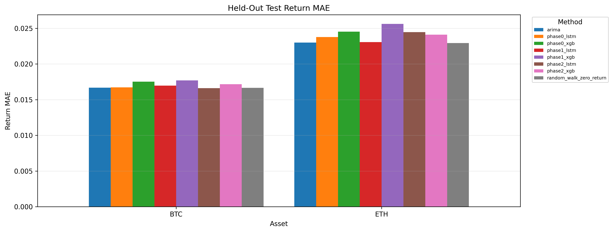

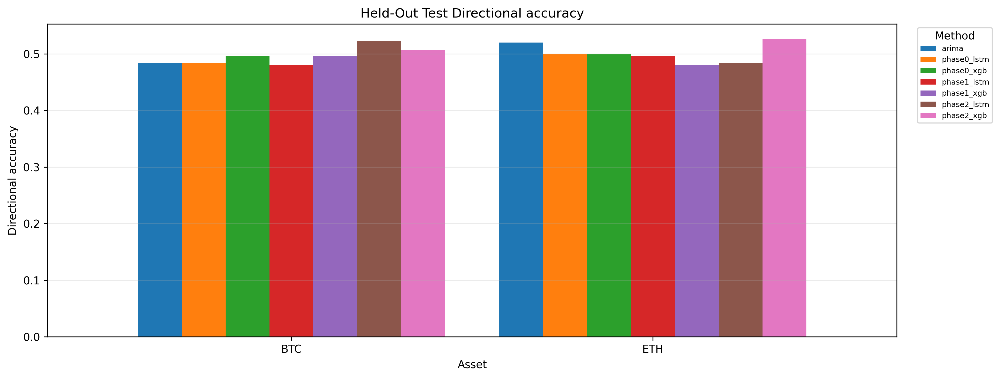

### Held-out return forecasts

**BTC**

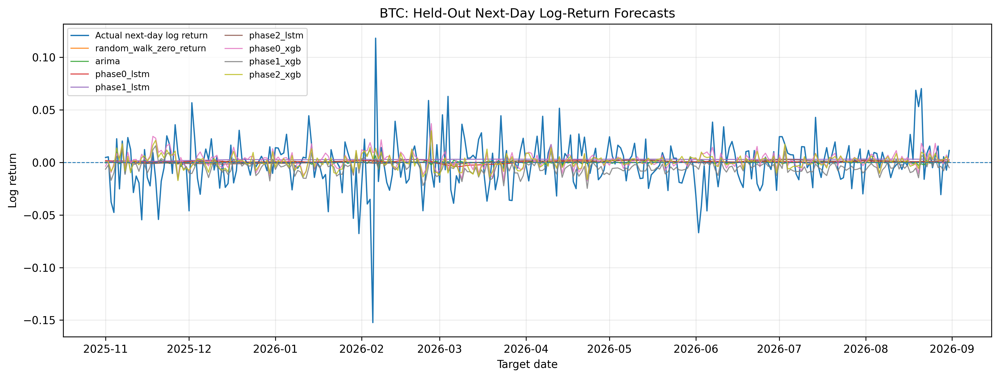

**ETH**

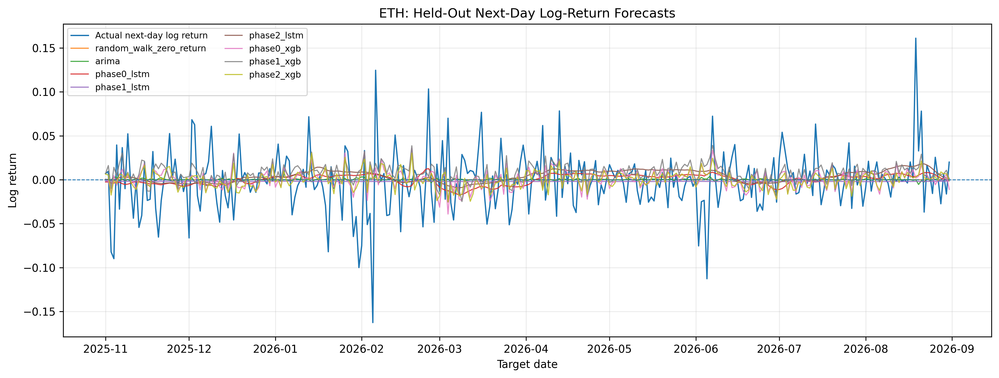

---

# 6. Phase 3: Information Scope, General vs Crypto-Specific News

Phase 3 holds the news provider and forecasting setup fixed while replacing general-news FinBERT features with asset-specific crypto-news FinBERT features.

This phase provides the clearest substantive result of the study.

### LSTM information-scope comparison

| Asset | General-news FinBERT MAE | Crypto-specific FinBERT MAE | Better scope | Relative MAE reduction | Held-out Holm-adjusted DM-HAC p |
|---|---:|---:|---|---:|---:|
| BTC | **0.016615** | 0.017040 | General news | **2.49%** | **0.00335** |
| ETH | 0.024451 | **0.023513** | Crypto-specific news | **3.84%** | **0.00615** |

The paired Wilcoxon Holm-adjusted p-values are also significant in the held-out sample: 0.00442 for BTC and 0.00126 for ETH.

The same ordering remains in walk-forward evaluation:

| Asset | Candidate scope | Candidate MAE | Reference scope | Reference MAE | Relative improvement |
|---|---|---:|---|---:|---:|
| BTC | General news | **0.016647** | Crypto-specific | 0.016892 | +1.45% |
| ETH | Crypto-specific | **0.023191** | General news | 0.023390 | +0.85% |

The walk-forward differences are smaller and no longer survive Holm correction. The most defensible interpretation is therefore an **asset-dependent information-scope effect that is directionally persistent but statistically sensitive to regime**.

### Paper-level comparison figure

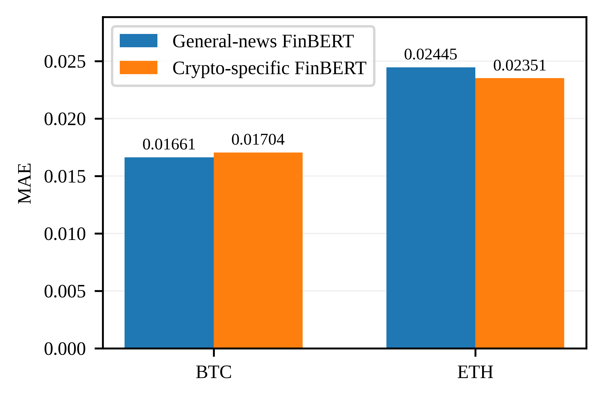

### Phase 3 summary metrics

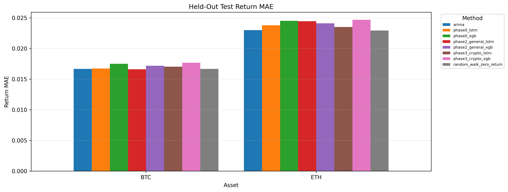

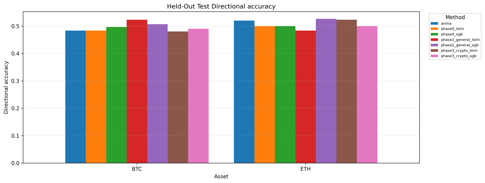

### Held-out return forecasts

**BTC**

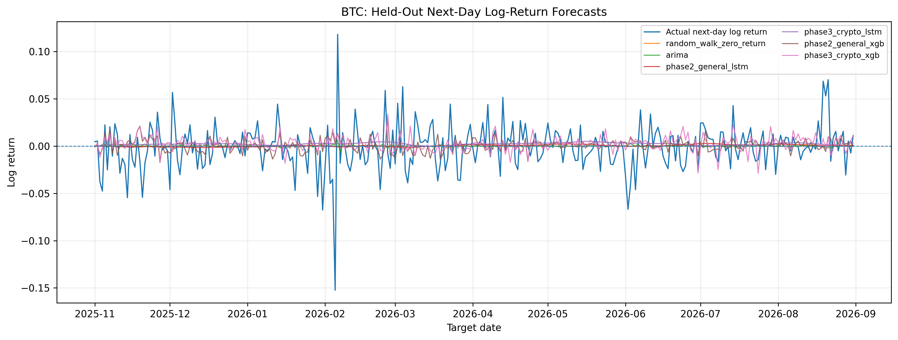

**ETH**

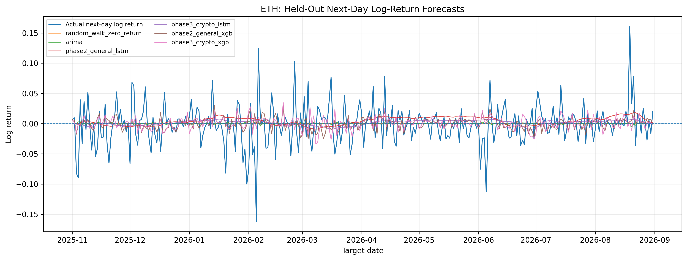

---

# 7. Phase 4: Temporal Ablation

Phase 4 tests whether shorter history, exponential recency weighting, or their combination improves the Phase 3 crypto-specific reference specification.

The decay rule is selected using validation data only. The corrected implementation normalizes the decay weights by their mean so that recency changes relative weighting without shrinking the overall standardized input magnitude.

The final selected half-life is **30 days**, corresponding to a daily decay rate of approximately **0.977160**.

### Held-out LSTM results

| Treatment | BTC MAE | BTC improvement vs reference | ETH MAE | ETH improvement vs reference |
|---|---:|---:|---:|---:|
| Phase 3 reference | 0.017040 | 0.00% | 0.023513 | 0.00% |
| Short only | **0.016848** | **+1.13%** | 0.022989 | +2.23% |
| Decay only | 0.017086 | -0.27% | 0.023302 | +0.90% |
| Short + decay | 0.016895 | +0.85% | **0.022957** | **+2.36%** |

For BTC, the short-window comparison has raw DM-HAC p = 0.0182, but Holm-adjusted p = 0.309. For ETH, the combined treatment has raw DM-HAC p = 0.0091, but Holm-adjusted p = 0.173. Therefore, neither Phase 4 gain is statistically robust after correction for multiple comparisons.

### Walk-forward LSTM results

| Treatment | BTC MAE | ETH MAE |
|---|---:|---:|
| Phase 3 reference | 0.016892 | 0.023191 |
| Short only | **0.016853** | 0.023077 |
| Decay only | 0.016913 | 0.023142 |
| Short + decay | 0.016859 | **0.023026** |

The best held-out improvements shrink to approximately **0.23% for BTC** and **0.72% for ETH** in walk-forward evaluation.

### Summary metrics

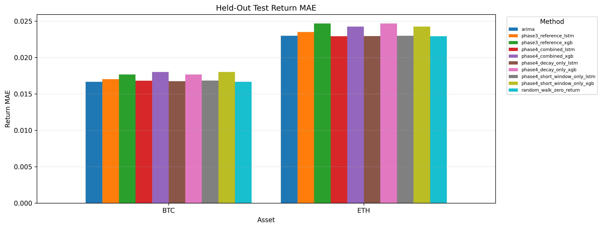

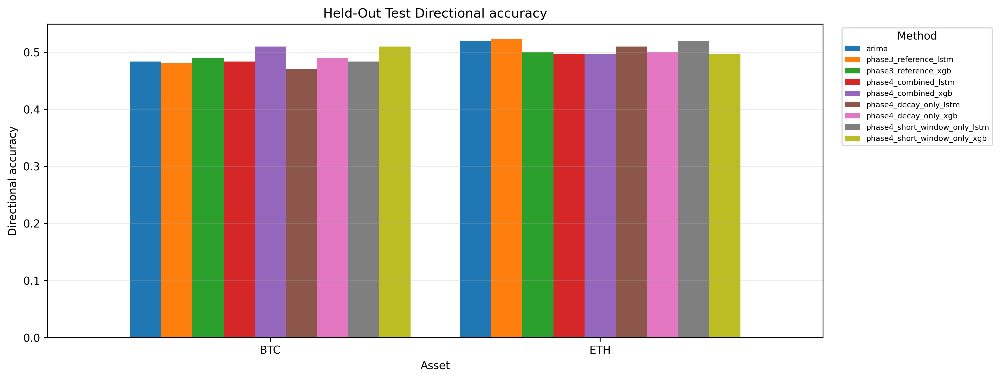

### Held-out return forecasts

**BTC**

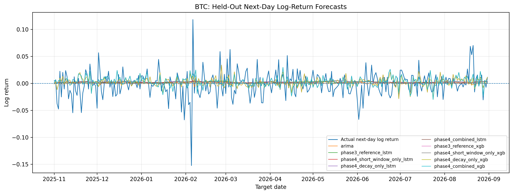

**ETH**

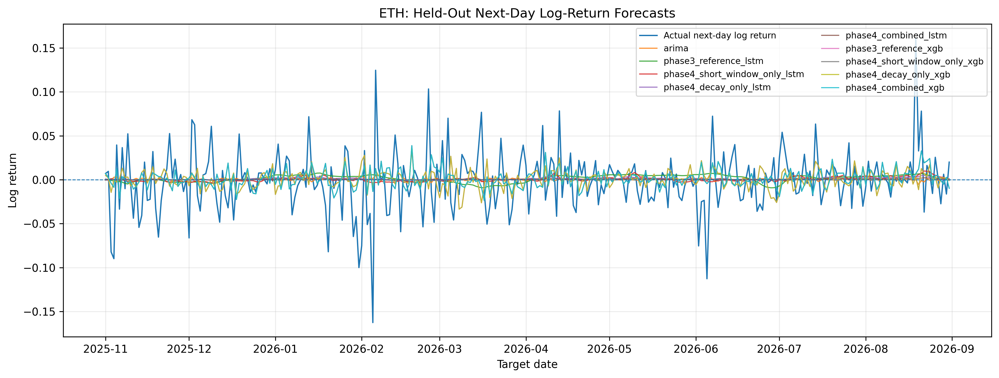

Additional files include `decay_rate_validation_sensitivity.csv`, `decay_rate_selection_summary.csv`, and `selected_decay_rate.json`.

---

# 8. Phase 5: Reliability-Aware Dual-Scope Fusion

Phase 5 is exploratory. It combines general-news and crypto-specific FinBERT signals using daily reliability measures based on coverage, FinBERT confidence, source diversity, and sentiment dispersion.

### Held-out LSTM results

| Asset | General-news | Crypto-specific | Simple concat | Reliability fusion |
|---|---:|---:|---:|---:|
| BTC | **0.016615** | 0.017040 | 0.016971 | 0.016912 |
| ETH | 0.024451 | 0.023513 | 0.023891 | **0.023150** |

For BTC, reliability fusion does not beat the stronger general-news model.

For ETH, reliability fusion improves MAE by **5.32% relative to general news** and by **1.54% relative to crypto-specific news**. The held-out comparison against general news survives Holm correction (DM-HAC p = 0.0105; Wilcoxon p < 0.001), while the comparison against crypto-specific sentiment does not.

### Walk-forward LSTM results

| Asset | General-news | Crypto-specific | Simple concat | Reliability fusion |
|---|---:|---:|---:|---:|
| BTC | **0.016647** | 0.016892 | 0.016879 | 0.016732 |
| ETH | 0.023390 | 0.023191 | 0.023456 | **0.023086** |

The ETH fusion ordering remains favorable, but the incremental advantage is smaller and no Phase 5 walk-forward comparison survives Holm correction.

### Summary metrics

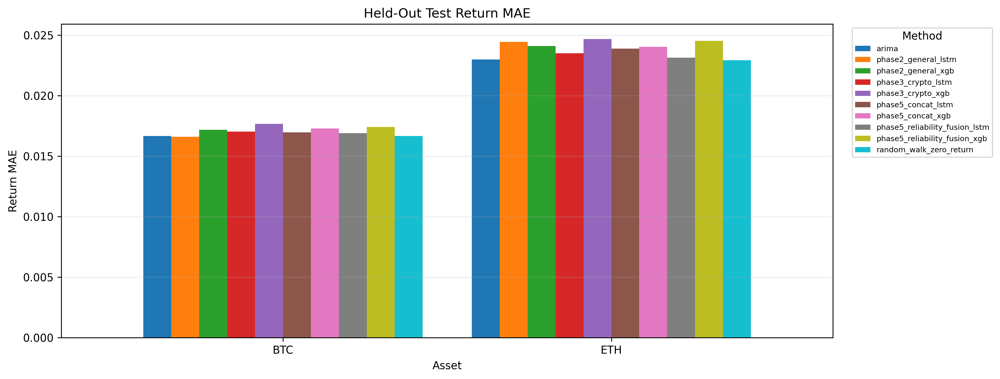

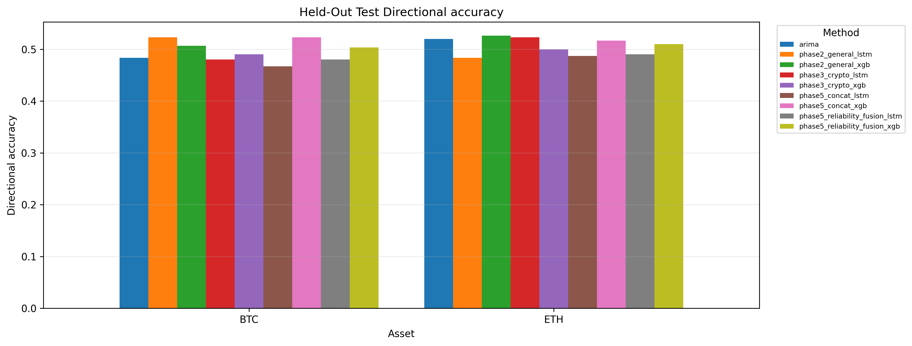

### Held-out return forecasts

**BTC**

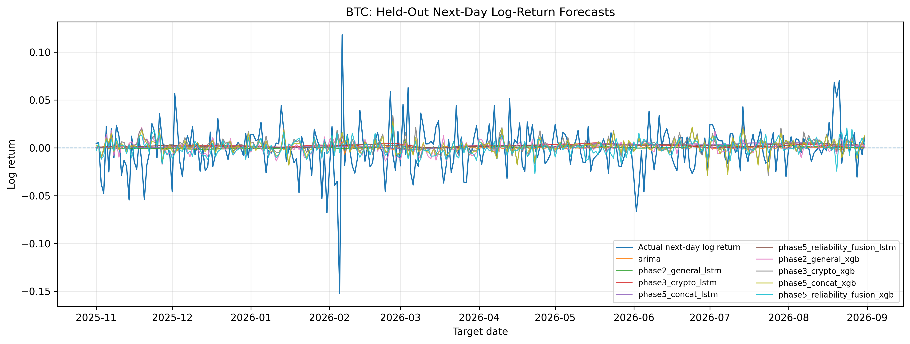

**ETH**

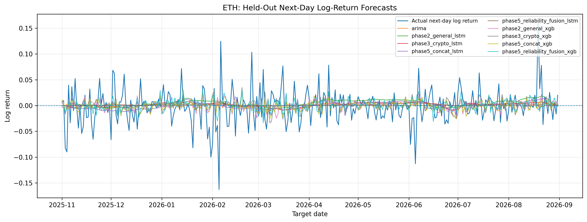

### Reliability scope weights

**BTC**

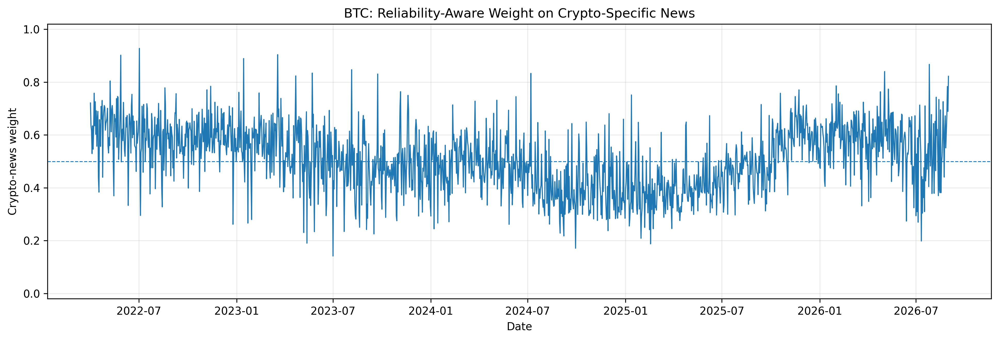

**ETH**

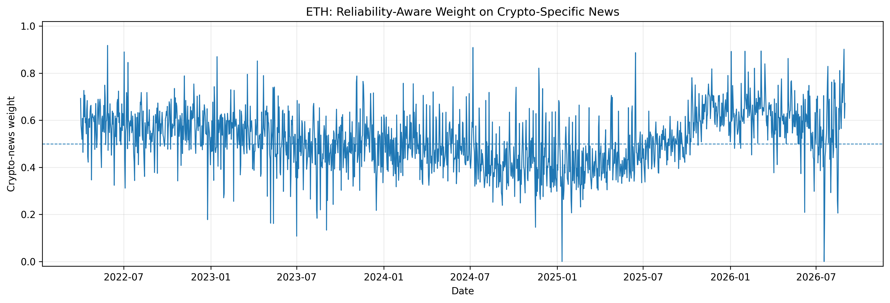

---

# 9. Provider-Volume Shift Diagnostic

The Phase 5 sensitivity audit identified a major structural change in Alpha Vantage general-news coverage around October 2025.

General-news volume increases from roughly **63 articles per day** before October 2025 to roughly **3,810 per day** afterward. Under the original reliability rule, the post-shift correlation between log general-news count and the general-news weight is approximately **0.79 for BTC** and **0.81 for ETH**.

After the normalized reliability correction, the same post-shift correlations fall to approximately **0.01 for BTC** and **0.04 for ETH**. This shows that the original weight shift was substantially driven by provider volume rather than clean evidence that general news suddenly became more informative.

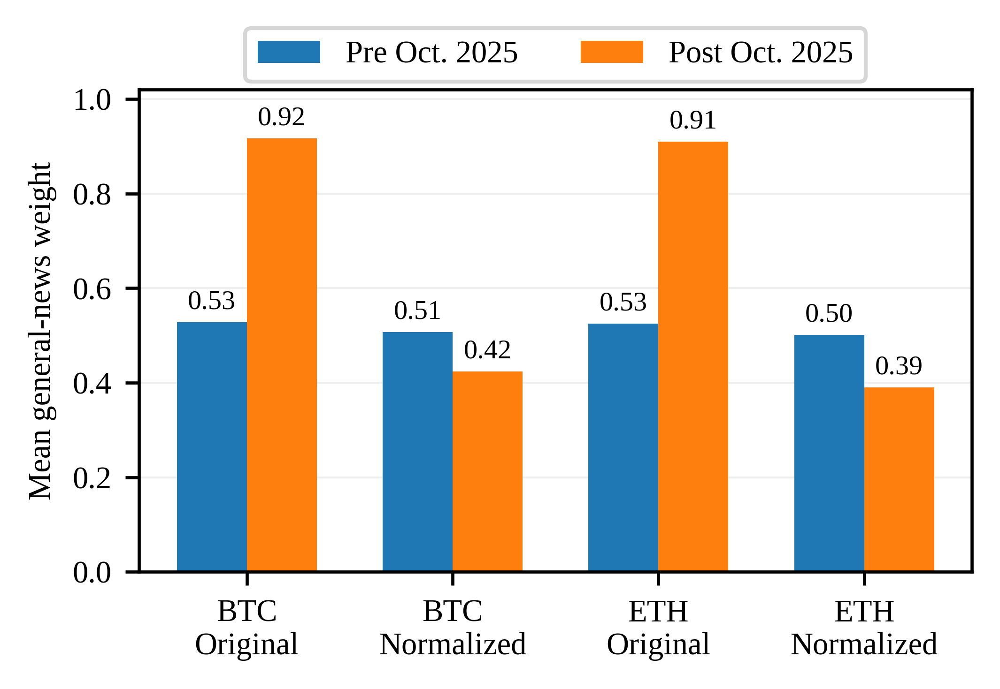

Detailed diagnostics are stored in:

- `phase5_reliability_fusion/provider_shift_weight_diagnostics.csv`
- `phase5_reliability_fusion/reliability_coverage_sensitivity.csv`
- `phase5_reliability_fusion/reliability_weight_audit.csv`

---

# 10. Cross-Phase Forecast Stability

The most important cross-phase pattern is that positive held-out effects often retain their direction but become smaller in walk-forward evaluation.

| Comparison | Held-out improvement | DM-HAC Holm p | Walk-forward improvement |
|---|---:|---:|---:|
| BTC Phase 2 vs Phase 0 | +0.67% | 0.669 | +0.61% |
| BTC General vs Crypto | **+2.49%** | **0.003** | +1.45% |
| ETH Crypto vs General | **+3.84%** | **0.006** | +0.85% |
| BTC Short vs Phase 3 reference | +1.13% | 0.309 | +0.23% |
| ETH Combined vs Phase 3 reference | +2.36% | 0.173 | +0.72% |
| ETH Fusion vs General | **+5.32%** | **0.010** | +1.30% |

This pattern is why the study treats temporal robustness as a central part of the evidence rather than reporting only one locked test result.

---

# 11. Statistical Inference

Forecast comparisons are based on daily ensemble predictions averaged across five prespecified seeds. The final inference pipeline uses:

| Method | Role |
|---|---|
| Diebold-Mariano with Newey-West HAC variance | Primary forecast-loss comparison using daily absolute-loss differentials |
| Paired two-sided Wilcoxon signed-rank test | Nonparametric robustness check |
| Holm correction | Controls familywise error within prespecified comparison families |
| Exact binomial test | Supplementary directional-accuracy inference |

The most statistically robust held-out information-scope findings are the Phase 3 BTC general-vs-crypto and ETH crypto-vs-general comparisons. Phase 4 gains have favorable raw DM-HAC p-values but do not survive Holm correction.

Final significance tables are stored in each phase's `significance_final.csv`, with cross-phase consistency information in `final_revision_audit/paper1_significance_registry.csv`.

---

# 12. No-News Audit

The FinBERT phases use sentiment, dispersion, and momentum features rather than article count as direct forecasting inputs. A dedicated audit verifies whether zero-filled no-news days create a practical ambiguity.

| News series | No-news days | Share of 1,584-day forecasting sample |
|---|---:|---:|
| General news | 0 | 0.00% |
| BTC-specific news | 0 | 0.00% |
| ETH-specific news | 2 | 0.13% |

The audit also finds no exact day on which all three FinBERT forecasting features are simultaneously zero in a way that creates a material collision in the final sample.

Files: `no_news_audit/no_news_day_audit.csv`, `no_news_audit/zero_feature_collision_audit.csv`, and `no_news_audit/finbert_feature_input_audit.csv`.

---

# 13. Economic Backtest

The economic backtest is a secondary robustness check, not the primary endpoint. It applies prespecified long/short sign rules and a cost-aware rule at one-way transaction costs of 0, 5, 10, 20, and 50 basis points.

Performance files report cumulative return, annualized return, annualized volatility, Sharpe ratio, maximum drawdown, turnover, and position changes. Some model/cost combinations produce positive realized performance, but the block-bootstrap confidence intervals for mean return relative to cash include zero for the reported strategies. Therefore, lower forecast error should **not** be interpreted as statistically established trading profitability.

### BTC cumulative wealth at 10 bps

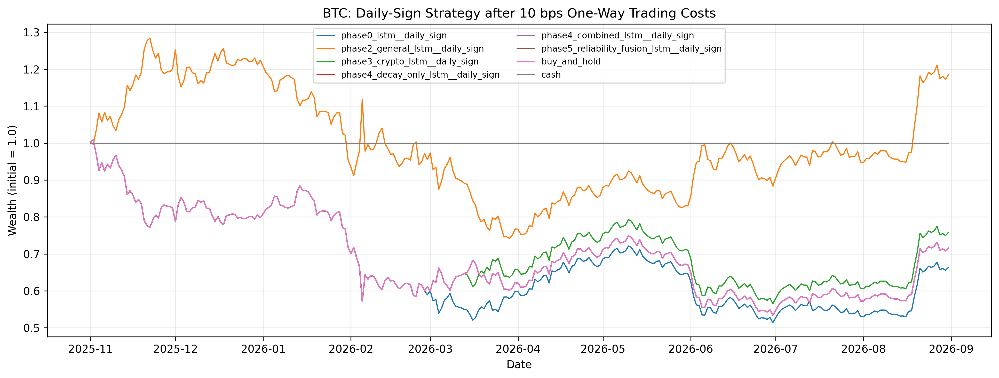

### ETH cumulative wealth at 10 bps

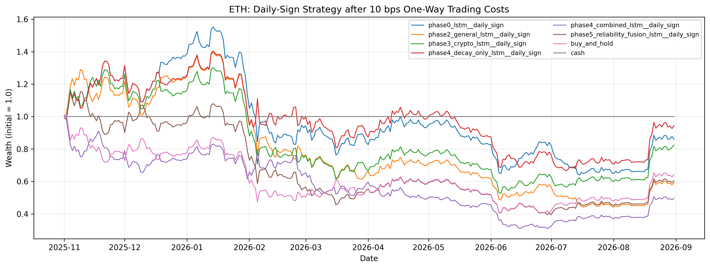

### Cost sensitivity

**BTC**

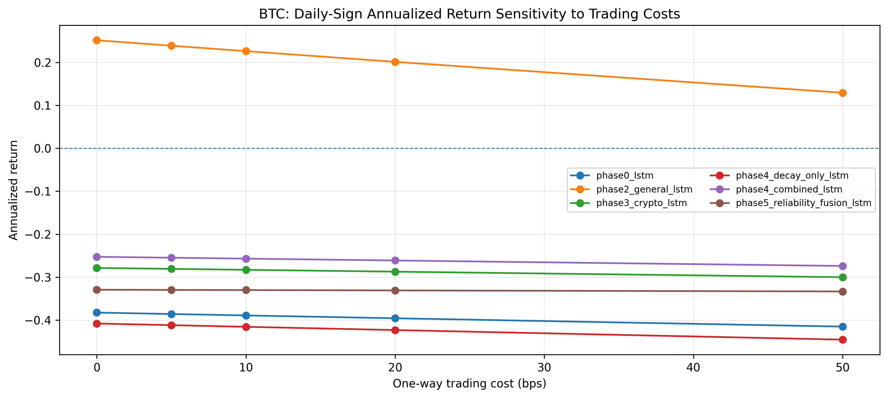

**ETH**

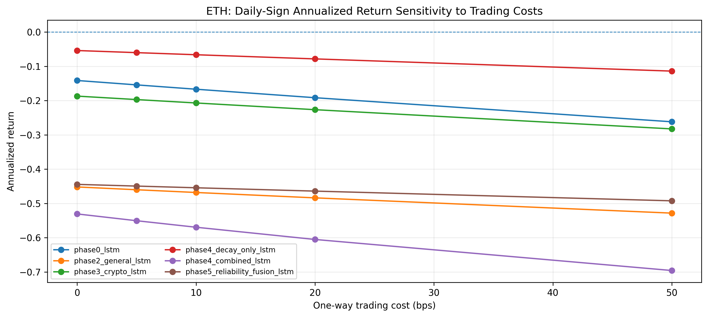

Detailed files: `economic_backtest/backtest_metrics.csv`, `backtest_primary_10bps.csv`, and `block_bootstrap_mean_return_ci.csv`.

---

# 14. Final Reproducibility and Consistency Audit

The final revision pipeline checks that results with the same scientific method are reused consistently across phases and that every reported significance comparison is linked to the exact prediction series used to calculate the corresponding metrics.

Final audit status:

| Audit | Result |
|---|---:|
| Canonical prediction reuse | **28 / 28 PASS** |
| Repeated-method consistency | **78 / 78 PASS** |
| Metric-to-significance linkage | **112 / 112 PASS** |
| Temporal alignment evidence | PASS |
| Timestamp convention audit | PASS |
| Phase 4 decay selection evidence | PASS |
| Phase 4 decay lock | PASS |
| Phase 5 reliability sensitivity evidence | PASS |
| Phase 5 provider-shift evidence | PASS |

Key audit files are under `final_revision_audit/`.

> **Provenance note:** some frozen canonical prediction artifacts may still contain legacy `revised_outputs_v3` path strings in metadata/provenance fields. These strings identify the validated source run from which canonical predictions were reused; they do not indicate that the final v4 metrics were recomputed from a different scientific specification. The final consistency audits above pass.

---

# 15. Guide to the Main Output Files

| File pattern | Description |
|---|---|
| `ensemble_metrics.csv` | Held-out metrics computed from the five-seed ensemble prediction |
| `ensemble_predictions.csv` | Daily held-out ensemble predictions used for final metrics/inference |
| `seed_metrics.csv` | Metrics for individual random seeds |
| `multiseed_summary.csv` | Across-seed summary statistics |
| `significance_final.csv` | Final DM-HAC, Wilcoxon, and Holm-adjusted comparisons |
| `walk_forward_ensemble_metrics.csv` | Expanding-window ensemble metrics |
| `walk_forward_ensemble_predictions.csv` | Daily expanding-window predictions |
| `walk_forward_significance_final.csv` | Statistical comparisons for walk-forward evaluation |
| `experiment_configuration.json` | Phase configuration and provenance |
| `environment_manifest.json` | Software/runtime environment metadata |
| `news_preprocessing_audit.csv` | News cleaning and preprocessing checks |
| `news_temporal_alignment_audit.csv` | Phase-specific news timing checks |

---

# 16. Overall Interpretation

The complete output package supports a conservative conclusion. News sentiment can provide incremental information for cryptocurrency return forecasting, but the effect is **conditional rather than universal**. General financial FinBERT is more useful for BTC than crypto-specific FinBERT, while the opposite ordering is observed for ETH. Shorter or more recent histories can produce modest improvements, but the Phase 4 gains do not survive multiplicity correction and become small in walk-forward evaluation. Reliability-aware fusion is promising for ETH, but its incremental advantage is also weaker across time.

The final evidence therefore supports sentiment as a **complementary, asset-dependent, and regime-sensitive information source**, not as a standalone forecasting or trading solution.
